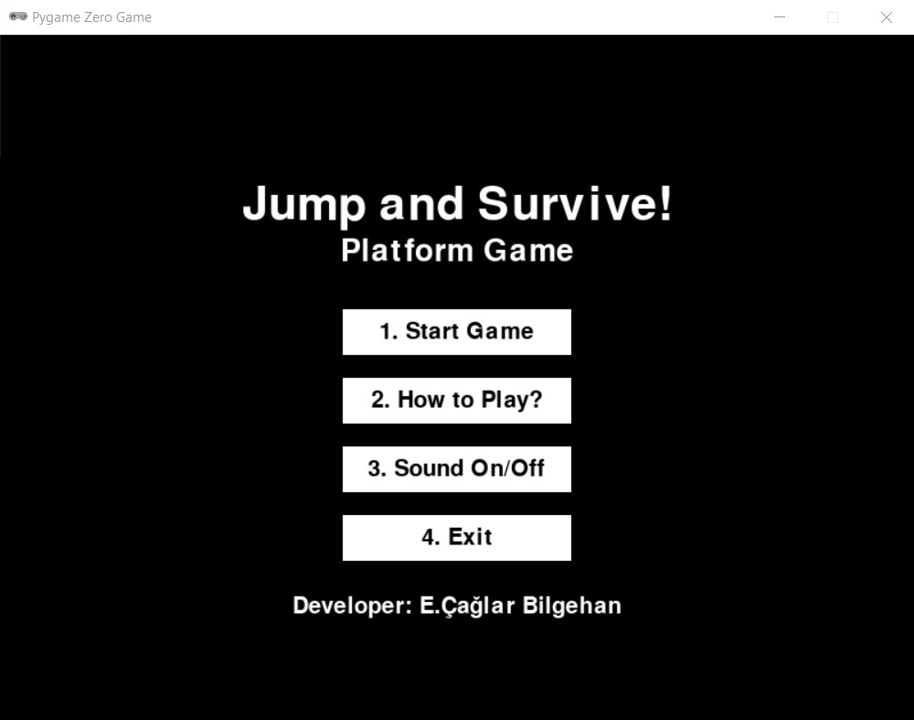
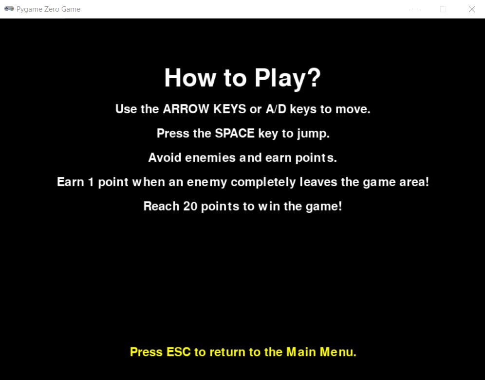
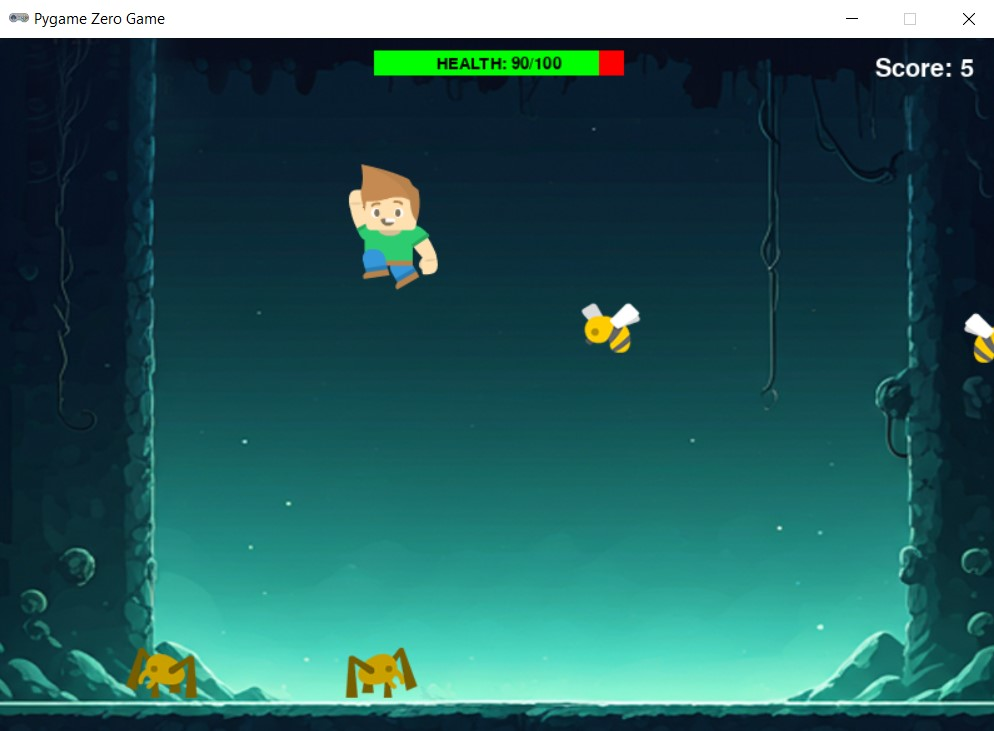

# 🕹️ Jump and Survive Game

"Jump and Survive" is an exciting 2D platformer game developed using **Pygame Zero**. Your objective is simple: jump, avoid obstacles, and survive as long as you can while scoring points!

---

## 🎮 Gameplay Features

- **Dynamic Movement:** Control your character with arrow keys or `A/D` keys for left and right movement.
- **Jump Mechanics:** Press the spacebar to jump over obstacles.
- **Enemies:**
  - **Spiders:** Avoid side collisions while earning points by jumping over them.
  - **Bees:** Fly through the game as additional challenging obstacles.
- **Health Bar:** Your health decreases when you collide with enemies. Keep an eye on it!
- **Winning Condition:** Reach a score of 20 to win the game.
- **Interactive Menu:** 
  - Start, pause, or restart the game.
  - Toggle background music on/off.
  - Learn how to play with a detailed guide.

---

## 🛠️ How to Play

1. Use **arrow keys** or `A/D` keys to move left and right.
2. Press **spacebar** to jump over enemies.
3. Avoid side collisions with spiders and bees to maintain your health.
4. Earn 1 point for every enemy that leaves the screen.
5. Reach 20 points to win the game!

---

## 🎵 Sounds and Animations

- **Background Music:** Can be toggled on or off from the main menu.
- **Sound Effects:** Hear jump sounds, footsteps, and collision effects for an immersive experience.
- **Smooth Animations:** Includes walking, jumping, and idle animations for both the hero and enemies.

---

## 📂 Project Structure

```
Jump-and-Survive/
├── game.py           # Main game logic
├── assets/           # Game assets (images, sounds)
│   ├── images/       # Sprite sheets and animations
│   ├── sounds/       # Music and sound effects
├── README.md         # Project documentation
```

---

## 🔧 Installation Instructions

1. Clone the repository:
   ```bash
   git clone https://github.com/caglarbilgehan/jump-and-survive.git
   cd jump-and-survive
   ```

2. Install Python and Pygame Zero:
   ```bash
   pip install pgzero
   ```

3. Run the game:
   ```bash
   python game.py
   ```

---

## 📸 Screenshots

### Main Menu


### How To Play?


### Gameplay


---

## 📹 Demo Video

[Watch the Video on YouTube](https://www.youtube.com/watch?v=RzOnH-Qf4mY)

---

## 🏆 Goals

- Reach 20 points to win the game.
- Avoid side collisions to maintain your health.
- Beat your high score!

---

## 🚀 Future Improvements

- Add new enemy types with unique movement patterns.
- Include power-ups like health boosts or temporary invincibility.
- Introduce new levels with increasing difficulty.

---

## 🤝 Contribution

Contributions are welcome! Feel free to fork the repository, make your changes, and open a pull request.

---

## 👨‍💻 Developer

This game was developed by **E. Çağlar Bilgehan**. For questions or suggestions, feel free to reach out!

📧 Email: [caglar@bilgehan.biz](mailto:caglar@bilgehan.biz)  
💻 GitHub: [caglarbilgehan](https://github.com/caglarbilgehan)

---

Thank you and have fun! 🎉